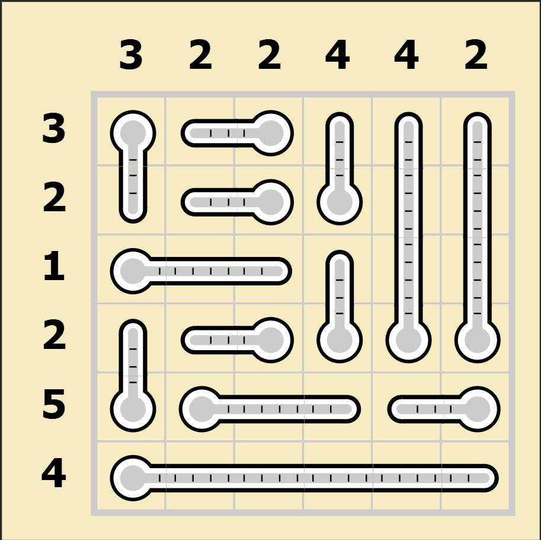
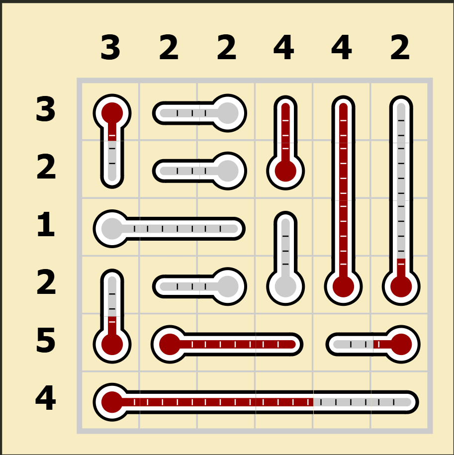
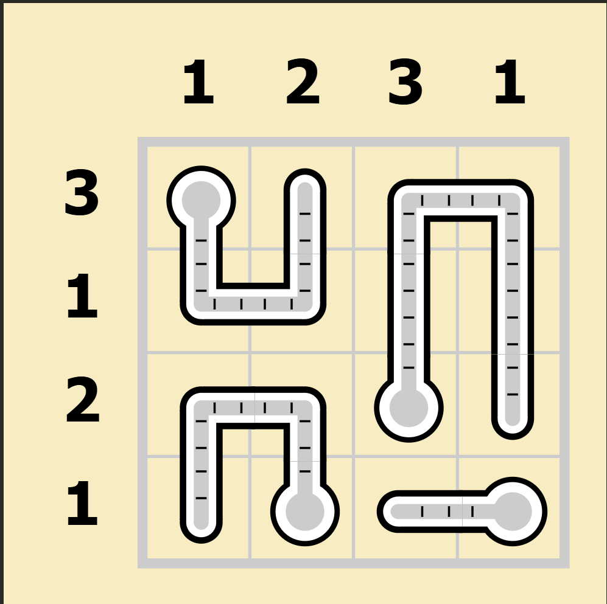
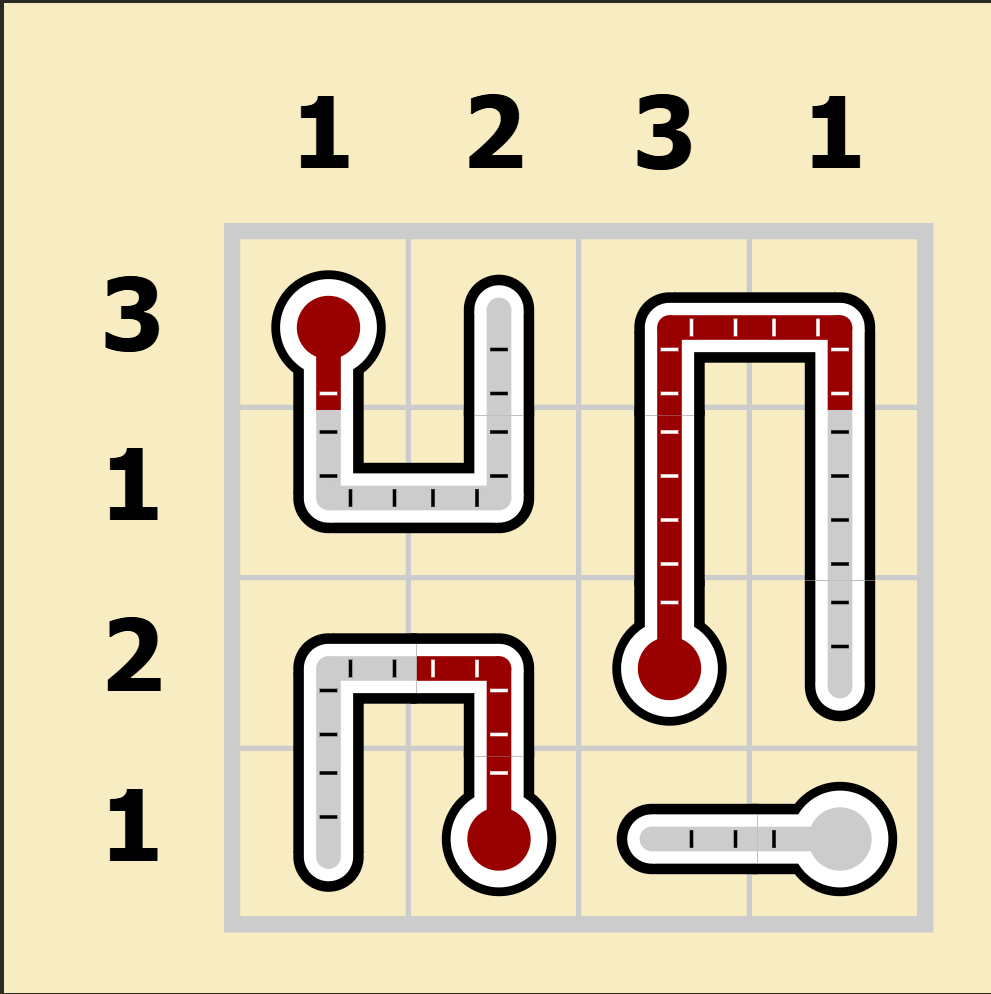

# Thermometers MIP Solver

[](https://opensource.org/licenses/MIT)

A Thermometers puzzle solver using mathematical programming.

## Overview

Thermometers is a logic puzzle where you must fill thermometers on a grid with mercury according to these rules:

- **Continuous filling from bulb** - thermometers fill from bulb end without gaps
- **Row and column constraints** - each row/column must have a specific number of filled cells

This solver models the puzzle as a **Mixed Integer Programming (MIP)** problem to find solutions.

## Installation

```bash
pip install thermometers-mip-solver
```

## Requirements

- Python 3.9+
- Google OR-Tools
- pytest (for testing)

## Example Puzzles

### 6x6 Puzzle with Straight Thermometers

This 6x6 puzzle demonstrates the solver with straight thermometers of various lengths and orientations:

| Puzzle | Solution |
|--------|----------|
|  |  |

```python
def example_6x6():
    """6x6 Thermometers Puzzle ID: 14,708,221 from puzzle-thermometers.com"""
    puzzle = ThermometerPuzzle(
        row_sums=[3, 2, 1, 2, 5, 4],
        col_sums=[3, 2, 2, 4, 4, 2],
        thermometer_waypoints=[
            [(0, 0), (1, 0)],               # Vertical thermometer starting in row 0
            [(0, 2), (0, 1)],               # Horizontal thermometer starting in row 0
            [(1, 2), (1, 1)],               # Horizontal thermometer starting in row 1
            [(1, 3), (0, 3)],               # Vertical thermometer starting in row 1
            [(2, 0), (2, 2)],               # Horizontal thermometer starting in row 2
            [(3, 2), (3, 1)],               # Horizontal thermometer starting in row 3
            [(3, 3), (2, 3)],               # Vertical thermometer starting in row 3
            [(3, 4), (0, 4)],               # Long vertical thermometer starting in row 3
            [(3, 5), (0, 5)],               # Long vertical thermometer starting in row 3
            [(4, 0), (3, 0)],               # Vertical thermometer starting in row 4
            [(4, 1), (4, 3)],               # Horizontal thermometer starting in row 4
            [(4, 5), (4, 4)],               # Horizontal thermometer starting in row 4
            [(5, 0), (5, 5)],               # Long horizontal thermometer starting in row 5
        ]
    )
    return puzzle
```

### 4x4 Puzzle with Curved Thermometers

This 4x4 puzzle shows how the solver handles curved thermometers with multiple waypoints, creating L-shaped and complex paths:

| Puzzle | Solution |
|--------|----------|
|  |  |

```python
def example_4x4_curved():
    """Curved 4x4 Thermometers Puzzle ID: 19,253,725 from puzzle-thermometers.com"""
    puzzle = ThermometerPuzzle(
        row_sums=[3, 1, 2, 1],
        col_sums=[1, 2, 3, 1],
        thermometer_waypoints=[
            [(0, 0), (1, 0), (1, 1), (0, 1)],    # U-shaped thermometer starting in row 0
            [(2, 2), (0, 2), (0, 3), (2, 3)],    # ∩-shaped thermometer starting in row 2
            [(3, 1), (2, 1), (2, 0), (3, 0)],    # ∩-shaped thermometer starting in row 3
            [(3, 3), (3, 2)],                    # Straight thermometer starting in row 3
        ]
    )
    return puzzle
```

## Usage

```python
from thermometers_mip_solver import ThermometerPuzzle, ThermometersSolver

# Load example puzzles
puzzle_6x6 = example_6x6()          # 6x6 puzzle with straight thermometers
puzzle_curved = example_4x4_curved() # 4x4 puzzle with curved thermometers

# Solve the 6x6 puzzle
print("Solving 6x6 puzzle...")
solver_6x6 = ThermometersSolver(puzzle_6x6)
solution_6x6 = solver_6x6.solve()

if solution_6x6:
    print(f"6x6 Solution found! Filled positions: {len(solution_6x6)} cells")
    
    # Validate the solution
    is_valid, errors = puzzle_6x6.validate_solution(solution_6x6)
    print(f"Solution is valid: {is_valid}")
    
    # Get solver information
    info = solver_6x6.get_solver_info()
    print(f"Model: {info['variables']} variables, {info['constraints']} constraints")

# Solve the curved 4x4 puzzle
print("\nSolving curved 4x4 puzzle...")
solver_curved = ThermometersSolver(puzzle_curved)
solution_curved = solver_curved.solve()

if solution_curved:
    print(f"Curved 4x4 Solution found! Filled positions: {len(solution_curved)} cells")
    print(f"Solution is valid: {puzzle_curved.validate_solution(solution_curved)[0]}")
```

## Waypoint System

The solver uses a **waypoint-based approach** to define thermometers. You only need to specify key turning points, and the system automatically expands them into complete thermometer paths:

- **Straight thermometers**: Define with start and end points: `[(0, 0), (0, 3)]`
- **Curved thermometers**: Add waypoints at each turn: `[(0, 0), (1, 0), (1, 1), (0, 1)]`
- **Path expansion**: Automatically fills in all cells between waypoints using horizontal/vertical segments
- **Validation**: Ensures all segments are properly aligned and thermometers have minimum 2 cells

## Testing

The project uses pytest for testing:

```bash
pytest                                          # Run all tests
pytest --cov=thermometers_mip_solver           # Run with coverage
```

## Mathematical Model

The solver uses **Mixed Integer Programming (MIP)** to model the puzzle constraints. Google OR-Tools provides the optimization framework, with SCIP as the default solver. Below is the complete mathematical formulation.

### Problem Definition

Given:
- An **m × n** grid representing the puzzle board
- **Row mercury requirements** R = {r₁, r₂, ..., rₘ} where rᵢ is the required number of mercury-filled cells in row i
- **Column mercury requirements** C = {c₁, c₂, ..., cₙ} where cⱼ is the required number of mercury-filled cells in column j
- **Thermometer paths** T = {T₁, T₂, ..., Tₖ} where each Tᵢ is an ordered sequence of cell positions representing a thermometer

**Objective:** Find which cells to fill with mercury to satisfy all Thermometers puzzle rules.

### Sets and Indices

| Symbol | Definition |
|--------|------------|
| **I** | Set of row indices: I = {0, 1, ..., m-1} |
| **J** | Set of column indices: J = {0, 1, ..., n-1} |
| **T** | Set of thermometers: T = {T₁, T₂, ..., Tₖ} |
| **Tᵢ** | Ordered sequence of positions for thermometer i: Tᵢ = [(r₁,c₁), (r₂,c₂), ..., (rₗᵢ,cₗᵢ)] |

### Decision Variables

| Variable | Domain | Definition |
|----------|--------|------------|
| **x_{i,j}** | {0, 1} | 1 if cell (i,j) is filled with mercury, 0 otherwise |

### Objective Function

This is a constraint satisfaction problem where the goal is to find a feasible solution that satisfies all constraints without optimizing any particular objective. Therefore, we define the objective function as:

```
minimize 0
```

### Constraints

#### 1. Row Sum Constraints
Each row must contain exactly the required number of mercury-filled cells:

```
Σⱼ x_{i,j} = rᵢ    ∀i ∈ I
```

#### 2. Column Sum Constraints  
Each column must contain exactly the required number of mercury-filled cells:

```
Σᵢ x_{i,j} = cⱼ    ∀j ∈ J
```

#### 3. Thermometer Continuity Constraints
For each thermometer, mercury must fill continuously from the bulb (first position). If position k+1 in the thermometer is filled, then position k must also be filled:

```
x_{rₖ₊₁,cₖ₊₁} ≤ x_{rₖ,cₖ}    ∀Tᵢ ∈ T, ∀k ∈ {1, 2, ..., |Tᵢ|-1}
```

Where (rₖ,cₖ) and (rₖ₊₁,cₖ₊₁) are consecutive positions in thermometer Tᵢ.

### Complete MIP Formulation

**Variables:**
```
x_{i,j} ∈ {0,1}    ∀i ∈ I, ∀j ∈ J
```

**Objective:**
```
minimize 0
```

**Subject to:**
```
Σⱼ x_{i,j} = rᵢ                                    ∀i ∈ I         (Row sums)

Σᵢ x_{i,j} = cⱼ                                    ∀j ∈ J         (Column sums)

x_{rₖ₊₁,cₖ₊₁} ≤ x_{rₖ,cₖ}                          ∀Tᵢ ∈ T, ∀k    (Thermometer continuity)

x_{i,j} ∈ {0,1}                                    ∀i ∈ I, ∀j ∈ J (Binary variables)
```


## License

This project is open source and available under the [MIT License](LICENSE).